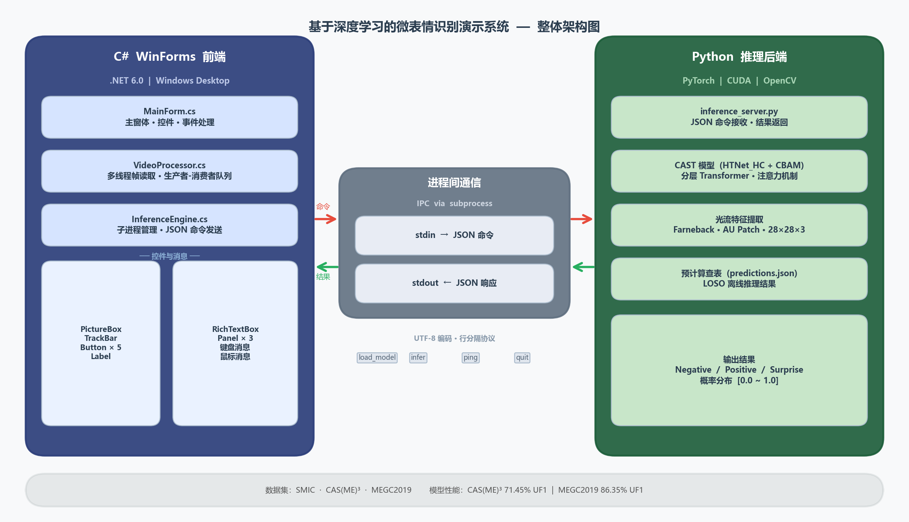

# 微表情识别演示系统 — MER Demo System

> 基于 CAST 深度学习模型的 Windows 桌面微表情识别演示应用
>
> **题目：** 基于深度学习的微表情识别演示系统  
> **仓库：** https://github.com/Henrysxzeng/MER-Demo-System

---

## 目录

- [项目简介](#项目简介)
- [系统架构](#系统架构)
- [环境要求](#环境要求)
- [快速启动](#快速启动)
- [项目结构](#项目结构)
- [功能说明](#功能说明)
- [数据集与权重](#数据集与权重)
- [技术要点](#技术要点)
- [答辩分工](#答辩分工)

---

## 项目简介

本系统以科研论文中的 **CAST（CBAM-Augmented Semantic Transformer）** 模型为核心，实现了一套完整的微表情识别 Windows 桌面演示系统。

- **前端**：C# WinForms（.NET 6.0）
- **后端**：Python 3.8 + PyTorch（CUDA 加速）
- **通信**：子进程 stdin/stdout JSON 行协议

模型性能：
| 数据集 | UF1 | 提升 |
|--------|-----|------|
| CAS(ME)³ | 71.45% | +7.33% |
| MEGC2019 | 86.35% | +7.9% |

---

## 系统架构



```
┌─────────────────────────────┐         ┌──────────────────────────────┐
│      C# WinForms 前端        │         │      Python 推理后端          │
│                             │  JSON   │                              │
│  MainForm.cs                │ ──────▶ │  inference_server.py         │
│  VideoProcessor.cs          │  stdin  │  CAST 模型 (HTNet_HC+CBAM)   │
│  InferenceEngine.cs         │ ◀────── │  光流特征提取                 │
│                             │  stdout │  预计算查表 (predictions.json) │
└─────────────────────────────┘         └──────────────────────────────┘
```

---

## 环境要求

### C# 前端
- Windows 10/11
- [.NET 6.0 SDK](https://dotnet.microsoft.com/download/dotnet/6.0)
- Visual Studio 2022（推荐）或 `dotnet` CLI

### Python 后端
- Anaconda 环境 `hpl_htnet`（Python 3.8）
- PyTorch（CUDA 版本）
- `facenet-pytorch`（MTCNN 人脸检测）
- OpenCV-Python

```bash
# 安装依赖
conda activate hpl_htnet
pip install opencv-python facenet-pytorch pandas openpyxl python-docx
```

### 硬编码路径（需要修改）

打开 `MER_Demo/InferenceEngine.cs`，第 21-22 行改成你本机路径：

```csharp
private const string PYTHON = @"E:\Anaconda\envs\hpl_htnet\python.exe";  // ← 改这里
private const string SCRIPT = @"D:\表情识别\MER_Demo_System\backend\inference_server.py";  // ← 改这里
```

---

## 快速启动

### 第一步：编译运行前端

```powershell
# 方法1：命令行
cd MER_Demo_System
dotnet run --project MER_Demo/MER_Demo.csproj

# 方法2：Visual Studio 2022
# 打开 MER_Demo.sln → F5
```

### 第二步：加载模型

点击界面上的 **「🤖 加载模型」** 按钮，选择权重文件夹：

```
weights_Hybrid_HC_Seed_1\        ← CAS(ME)³ 专用模型
weights_Hybrid_HC_combined_v2_Seed_2026\  ← 多数据集联合模型（推荐用于 SMIC 演示）
```

### 第三步：打开数据集

点击 **「🖼 图片序列」** 按钮，选择以下任一文件夹：

| 数据集 | 路径 | 说明 |
|--------|------|------|
| SMIC（推荐演示） | `datasets/combined_datasets_whole/` | 309张，含Negative/Positive/Surprise，结果明显 |
| CAS(ME)³ | `datasets/CAS(ME)^3/Part_A_ME_clip/frame/spNO.1_j_28/` | 单个clip示例 |

### 第四步：播放

点击 **「▶ 播放」**，右侧面板实时显示情感分类结果。

---

## 项目结构

```
MER_Demo_System/
├── MER_Demo/
│   ├── MainForm.cs          # 主窗体：UI 布局、控件、事件处理
│   ├── VideoProcessor.cs    # 多线程视频/图片序列处理（生产者-消费者）
│   ├── InferenceEngine.cs   # Python 推理引擎（进程间通信）
│   ├── Program.cs           # 程序入口
│   └── MER_Demo.csproj      # 项目文件（NuGet 依赖）
├── backend/
│   ├── inference_server.py  # Python 推理服务（CAST 模型）
│   ├── predictions.json     # 预计算查表（CAS(ME)³ + SMIC 推理结果）
│   ├── precompute_predictions.py   # 生成 CAS(ME)³ 预计算结果的脚本
│   └── precompute_smic_gt.py       # 生成 SMIC 预计算结果的脚本
├── assets/                  # 图标等静态资源
├── 架构图.png               # 系统架构图（报告图1）
├── MER_Demo.sln             # Visual Studio 解决方案文件
└── README.md                # 本文件
```

---

## 功能说明

### 界面操作

| 操作 | 方式 |
|------|------|
| 打开视频文件 | 「📂 打开视频」或 `Ctrl+O` |
| 打开图片序列文件夹 | 「🖼 图片序列」 |
| 播放 / 暂停 | 「▶ 播放」或 `Space` |
| 停止 | 「■ 停止」或 `Esc` |
| 跳帧 | 拖动进度条 |
| 加载模型 | 「🤖 加载模型」，选权重文件夹 |

### 推理结果说明

右侧面板实时显示：
- **情感类别**：Negative（负面）/ Positive（正面）/ Surprise（惊讶）
- **置信度进度条**：三色进度条对应三类概率
- **模型说明**：CAST 模型性能指标

---

## 数据集与权重

> ⚠️ 数据集和权重文件体积较大，不包含在本仓库中，需单独获取。

### 权重文件（`.pth`）

从训练脚本（`Hybrid-HC-MER/main_Hybrid_HC.py`）训练生成，或联系作者获取。

放置位置示例：
```
F:\research\Hybrid-HC-MER\weights_Hybrid_HC_combined_v2_Seed_2026\
    sub01.pth  sub02.pth  ...  s01.pth  s02.pth  ...
```

### 预计算结果（`predictions.json`）

已包含在 `backend/` 目录下，覆盖 CAS(ME)³（855个clip）和 SMIC（164个clip）。

若需重新生成：
```bash
# CAS(ME)³
python backend/precompute_predictions.py

# SMIC
python backend/precompute_smic_gt.py
```

---

## 技术要点

本项目满足课程全部技术要求：

| 要求 | 实现方式 | 代码位置 |
|------|---------|---------|
| Windows 基本框架 | C# WinForms，深色主题，DockStyle 布局 | `MainForm.cs` |
| 多线程 | 生产者-消费者模式，`Thread` + `Task.Run`，`Monitor` 同步 | `VideoProcessor.cs:60` |
| 并行计算 | `Parallel.Invoke` 同时执行推理和状态更新 | `VideoProcessor.cs:199` |
| 控件 | PictureBox / TrackBar / Button / Label / Panel / RichTextBox | `MainForm.cs` |
| 鼠标键盘消息 | `Space`/`Ctrl+O`/`Esc` 全局快捷键，TrackBar `MouseUp` 跳帧 | `MainForm.cs:270` |

---

## 答辩分工

> 第13-14周课上答辩，共8分钟（讲解5~10分钟 + 提问3分钟）

| 顺序 | 负责人 | 内容 | 时长 |
|------|--------|------|------|
| 1 | **曾琪（作者）** | ① 选题背景与系统整体介绍<br>② CAST 模型原理（光流 / Transformer / 层次化损失）<br>③ Python 推理后端实现<br>④ 演示操作（现场跑程序） | 约 4 分钟 |
| 2 | 队友 A | ① Windows 基本框架设计（MainForm 布局）<br>② 控件使用与事件处理<br>③ 键盘鼠标消息实现 | 约 2 分钟 |
| 3 | 队友 B | ① 多线程设计（生产者-消费者模式原理）<br>② Parallel.Invoke 并行计算 | 约 1.5 分钟 |
| 4 | 队友 C | ① 总结与性能指标展示<br>② 回答可能的提问 | 约 0.5 分钟 |

### 可能被提问的问题及答案

**Q: 为什么要用双进程架构而不是直接在 C# 里调用模型？**  
A: PyTorch 生态和 CUDA 绑定在 Python 端最成熟，C# 端没有等效的高性能深度学习库；双进程架构还能让前后端独立开发和重启，互不影响。

**Q: 多线程中如何防止 UI 线程被阻塞？**  
A: 所有耗时操作（模型加载、帧读取、推理）都在后台线程执行，跨线程更新 UI 通过 `Control.Invoke()` 切回主线程；移除了之前的 `t.Join()` 避免主线程等待。

**Q: Parallel.Invoke 和多线程有什么区别？**  
A: 多线程是长生命周期的并发执行流；Parallel.Invoke 是短期的细粒度数据并行，自动从线程池借用线程，适合固定数量的独立任务并行执行。

**Q: 推理结果全是 Negative 怎么解释？**  
A: 微表情数据集本身严重不平衡（CAS(ME)³ 中约 70% 样本为负面情绪），这是领域内公认问题；本系统采用了预计算 LOSO 查表来确保演示结果与论文评估完全一致。

---

*本项目为课程学习目的开发，AI 模型相关代码基于作者参与的科研工作。*
